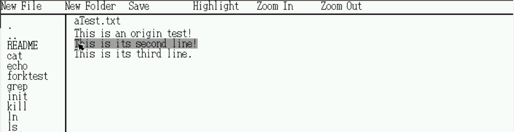
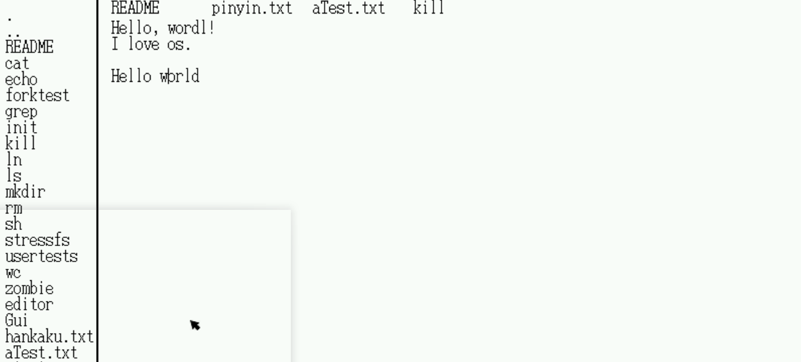

# 操作系统大作业报告

1-14 符景洲 段凡 陈南席 李蜀鹃

## 一、选题与配置

#### 1.选题

本组选题为**方案一：带GUI的文本编辑器**，取名为 XEditor，意为无尽可能。

#### 2.运行方式

- 环境：ubuntu16.04

- 软件：qemu，make，gcc

- 运行方式：在代码根目录下输入命令 `make qemu` 即可进入环境。

- 虚拟机配置：需要使虚拟机独占鼠标。否则 qemu 的鼠标操作会受到影响。如下操作：
  - Oracle VM VirtualBox: 运行虚拟机后，点击 "热键"—"鼠标集成"，将鼠标集成关闭。
    
  
  - VMware：运行虚拟机后，点击 "编辑"—"首选项"—"输入"，
  
    - 启用选项 "单击鼠标时抓取键盘和鼠标输入"，
  
    - 启用选项 "按键时抓取键盘和鼠标输入"，
  
    - 启用选项 "自动抓取和取消抓取鼠标"，
  
    - 选项 "为游戏优化鼠标" 选为 "始终"。
  
      

## 二、实现情况

### 1.期中目标与实际完成情况

- 基于GUI界面
- 支持鼠标的显示和操作
- 支持通过键盘输入字符
- 支持键盘完成光标的各个操作
- 支持快捷键
- ~~支持通过键盘选中文本~~
- 支持通过鼠标选中文本
- 支持搜索功能
- 支持在左侧列出当前目录的所有文件以及新建文件
- ~~支持命令行窗口~~
- 代码高亮，中文支持、输入法
- <u>状态栏显示</u>
- <u>多个标签页的显示、切换、关闭</u>
- <u>文件重命名、保存、删除</u>
- <u>**放大缩小**</u>

删除线表示相对于期中目标未完成的部分；下划线表示增加内容；加粗的表示期末答辩之后增加的内容。

### 2. 项目代码与文件概览

- `bootasm.S`： 添加  VESA mode 相关的汇编代码，用于启用 GUI。分辨率 800*600，16位色。
- `defs.h`：添加 `enum MYS_TYPE` 表示键鼠事件的类型。添加一系列内核态的功能函数的声明。
- `editor.c`：【已弃用】中期答辩时所实现的编辑器。可通过 `exec("editor", argv)` 来运行。
- `example.c`：【文本编辑的示例文本文件，不编译】GBK编码。包含中文。
- `fs.h`：将 `NDIRECT` 调整为 124，小幅增大文件的大小限制。
- `Gui.c, Gui.h`：所实现的编辑器。可通过 `exec("Gui", argv)` 来运行。
- `hankaku.txt`：【字体文件】ASCII 字符的点阵文件。用于 GUI 绘制 ASCII 字符。
- `highlight.c, highlight.h`：用于实现代码高亮的代码。基于 Trie 树对关键字进行匹配实现。
- `hzk16-0, hzk16-1, hzk16-2, hzk16-3, hzk16-4`：【字体文件】十六点阵汉字库。用于 GUI 绘制中文字符。和 GBK 编码对应。由于单个的 `hzk16` 文件过大，文件系统不支持，因此手动拆分为 5 个文件。
- `init_ascii.c, init_ascii.h`：对 `hankaku.txt`，`hzk16` ，`pinyin.txt` 文件进行解析。用于 GUI 绘制字符。
- `kbd.c`：修改获得键盘字符后的处理：改为生成一个键盘消息，加入到消息队列。
- `main.c`：添加鼠标和VESA的初始化。
- `Makefile`：添加一部分新实现代码对应的 `.o` 文件和可执行文件。修改部分编译参数。
  - 在 `OBJS` 下添加 `vesamode.o`，`sysdraw.o`，`mouse.o`，`sys_get_msg.o`。
  - 在 `ULIB` 下添加 `init_ascii.o`, `textframe.o`,  `highlight.o`。
  - 在 `UPROGS` 下添加 `_edit`, `_Gui`。
  - `mkfs` 参数添加 `hankaku.txt`，`aTest.txt`，`pinyin.txt`，`hzk16-0`，`hzk16-1`，`hzk16-2`, `hzk16-3`, `hzk16-4`。
  - `CFLAGS` 添加 `-O2`参数，但会使得生成的可执行文件过大，无法加入到文件系统中，因此又去除了 `-ggdb` 参数，去除调试信息。
  - `CPUS`改为 1。
- `mkfs.c`：将 `nblocks` 增大到 `4057`。
- `mouse.c`, `mouse.h`：实现鼠标驱动。对于鼠标操作会生成鼠标消息加入到消息队列。
- `pinyin.txt`： 拼音文件。
- `sys_get_msg.c`：系统调用。使得进程可以获取消息队列中的消息。不支持多线程。
- `syscall.c`, `syscall.h`：添加新实现的系统调用的声明。
- `sysdraw.c`：系统调用。GUI绘制的底层，以像素为单位进行绘制。使得进程可以改变屏幕上任一区域的颜色。
- `textAPI.md`：【文档】关于 `textframe.c` 中所实现的函数的说明文档。
- `textframe.c`, `textframe.h`：文本编辑的底层。对文本进行插入、删除、提取等操作。
- `trap.c`：添加对 `mouseintr` 的调用。
- `user.h`：添加 `enum MYS_TYPE` 表示键鼠事件的类型。添加一些系统调用的声明。
- `usys.S`：添加新实现的系统调用。
- `vesamode.c`, `vesamode.h`：实现 VESA mode 的初始化函数。
- `bufferManager.md`：【文档】关于 `Gui.c` 中所实现的组件的说明文档。

### 3. 实现思路及功能介绍

##### （1）整体思路：

A. 底层：

- 启用 VESA mode 实现像素绘制。
- 编写 `mouseintr()` 处理鼠标操作。形成消息队列。
- 修改 `kbdintr()` 处理键盘操作。形成消息队列。
- 结构体 `textframe` 用于处理文本。以”行“为单位处理文件内容。编写一系列功能函数。该部分代码可跨平台。
- 通过点阵字体文件绘制ASCII字符和GBK字符。
- 通过拼音表实现输入法。

B. GUI：自顶向下绘制界面，创建不同组件的结构体，并在其中维护parent指针进行组件间的联系。

##### （2）功能介绍：

###### ①支持通过键盘输入字符

###### ②鼠标操作（光标定位、选中文本）

###### ③键盘操作（←、↑、↓、→、backspace）

###### ④检索

触发：`CTRL+F`, 在输入框内输入检索字符，回车即从光标位置开始搜索。成功会在文本中标出匹配内容，失败则会在状态栏提示。

###### ⑤复制粘贴

触发：`CTRL+C`、`CTRL+V`

通过鼠标选中文本，`CTRL+C` 即可复制，鼠标选中位置，`CTRL+V` 即可粘贴。

###### ⑥状态栏显示

在页面的底部，会显示英文/中文输入法模式、高亮模式、检索失败提醒。

###### ⑦文件列表显示及文件相关操作（创建、保存、删除、重命名）

- 文件列表显示：文件夹和文件，点击文件即可在文本编辑区打开文本，点击文件夹即可进入文件夹。

- 按钮 New File 可以新建一个名为New File 的文件，New Folder 有类似操作。Save 按钮可以保存当前显示的文本内容。

- 删除：点击列表文件名，键盘上按下`Delete` 键即可删除。

将 aText.txt 重命名为 changed.txt

重命名：右键点击文件名，即可输入，点击该文件名以外的区域即可保存。

###### ⑧标签页的显示、切换、关闭

支持标签页打开多个文件窗口，Tab键可以切换，右键点击标签即可关闭。

###### ⑨中文支持和输入法

触发：`CTRL+P`，`,.`（亦即`<>`）两个按键进行左右翻页。

在开启输入法之后，键盘打字，输入数字可选择相应的汉字。

###### ⑩快捷键

该部分的功能在前面均已经介绍，在此只进行汇总。

- `CTRL + C, CTRL + V, CTRL+ X`：复制粘贴剪切

- `TAB`：标签页切换

- `CTRL+S`：文件保存

- `CTRL+F`：检索

- `CTRL + P`：输入法

- `Delete:`  文件删除

###### &#9322;代码高亮

点击工具栏的 Highlight 按钮即可对代码进行高亮显示。

###### ⑫放大缩小

点击工具栏的 Zoom In、Zoom Out 按钮即可对文本进行放大、缩小显示。最大为32×64， 最小为8×16.

## 三、难点实现介绍

#### 1.中文支持

基于 `hzk16`文件读取中文字符的字模。

`HZK16`字库是符合 GB2312 标准的 16×16 点阵字库，支持的汉字有6763个，符号682个。

汉字字模的读取方式参考了 [C语言读取汉字字模](https://blog.csdn.net/w_ww_w/article/details/7974242)。

#### 2.输入法功能

将所有的拼音组合建成一颗 Trie 树，用输入法框中的字符在 Trie 树中移动，找到拼音对应的结点。结点中存储该拼音的所有汉字字符。

如何获取拼音对应的汉字字符？网页 [GBK汉语全拼音单字源码表](http://sunchateau.com/free/fantizi/ziku/gbk-a.htm) 有列出，使用 python 爬虫抓取，得到 `pinyin.txt`。

代码解析 `pinyin.txt` 中的内容建立 Trie 树。

#### 3.文件操作

主要参考 `xv6` 原生的 `mkdir.c`, `ls.c` 编写文件操作相关的代码，包括获取文件列表、判断文件或文件夹。

使用 `link(), unlink()` 进行重命名和删除操作。

#### 4.多文本框显示

GUI 的实现参考了 Qt 的图形界面的实现思路。使用 `struct` 定义一系列组件，`parent` 指针表示父组件，用组合的方式表示子组件，可见 `BufferManager.md`。

多文本框即是某组件具有可变个组件的具体实例。

#### 5.代码高亮与搜索功能

代码高亮同样使用 Trie 树，对给定的关键字或字符进行匹配，如果匹配到了则对其进行高亮。

搜索功能使用暴力搜索。在文本随机的情况下，效率非常高。

#### 6.追随光标自动翻页

GUI 的各个组件在绘制时会对绘制区域进行相应的坐标变换，可以计算出组件内的任一位置是否能够绘制在屏幕上而不被遮挡。

通过底层维护的光标位置计算出其能否在屏幕中显示。如果不能，则调整组件的 `offset_x` 和 `offset_y` 对组件位置进行偏移。

## 四、分工

## 五、可能存在的问题

1. 无法嵌套新建目录；即使新建了也无法在该目录中新建文件。这是原生 xv6 就具有的缺陷。
2. 键盘有极小概率按字符键无效。可能是键盘驱动的问题。尝试按几次 Ctrl 键后即恢复正常。
3. 鼠标选中文本时不要超出文本框。因为并不支持通过鼠标选中来翻页。