# 操作系统大作业报告

1-14 符景洲 段凡 陈南席 李蜀鹃

## 一、选题与配置

#### 1.选题

本组选题为**方案一：带GUI的文本编辑器**，取名为XEditor，意为无尽可能。

#### 2.运行方式

环境：ubuntu16.04

软件：qemu，make，gcc

运行方式：在代码根目录下输入命令`make qemu`即可进入环境。

鼠标显示配置：

关闭鼠标集成

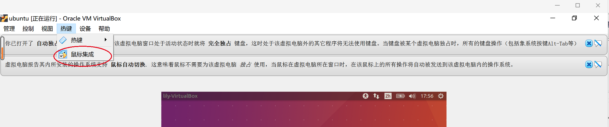

## 二、实现情况

### 1.期中目标与实际完成情况

- 基于GUI界面
- 支持鼠标的显示和操作
- 支持通过键盘输入字符
- 支持键盘完成光标的各个操作
- 支持快捷键
- ~~支持通过键盘选中文本~~
- 支持通过鼠标选中文本
- 支持搜索功能
- 支持在左侧列出当前目录的所有文件以及新建文件
- ~~支持命令行窗口~~
- 代码高亮，中文支持、输入法
- <u>状态栏显示</u>
- <u>多个标签页的显示、切换、关闭</u>
- <u>文件重命名、保存、删除</u>
- <u>放大缩小</u>

删除线表示相对于期中目标未完成、下划线表示增加内容

### 2.实现思路及功能介绍

##### （1）整体思路：

A. 底层：

B. GUI：自顶向下绘制界面，创建不同组件的结构体，并在其中维护parent指针进行组件间的联系。

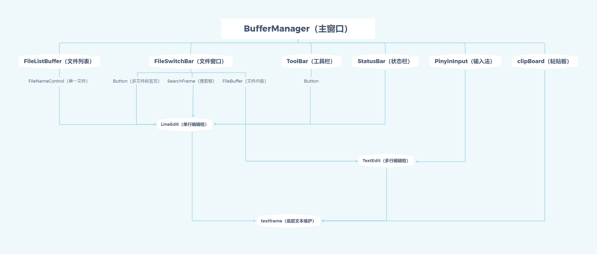

##### （2）功能介绍：

###### ①支持通过键盘输入字符

###### ②鼠标操作（光标定位、选中文本）

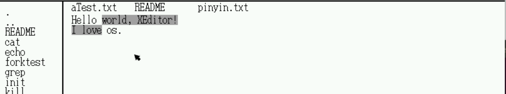

###### ③键盘操作（←、↑、↓、→、backspace）

###### ④检索

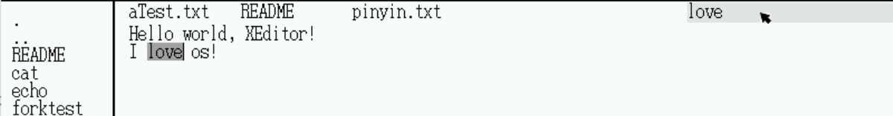

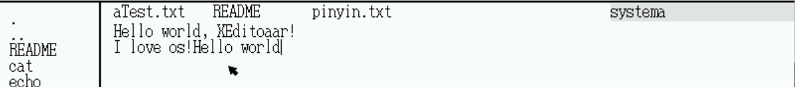

触发：CTRL+F, 在输入框内输入检索字符，回车即从光标位置开始搜索。成功会在文本中标出匹配内容，失败则会在状态栏提示。

###### ⑤复制粘贴

触发：CTRL+C、CTRL+V

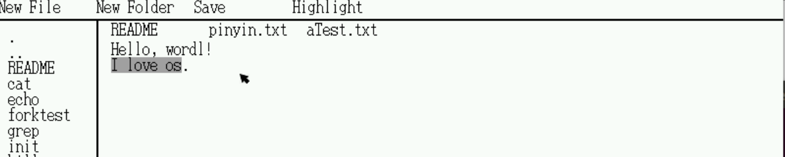

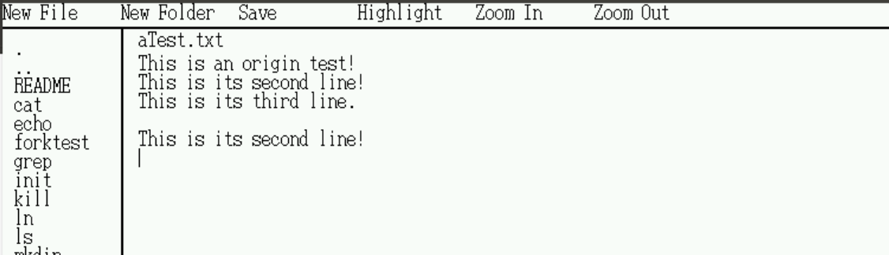

通过鼠标选中文本，CTRL+C即可复制，鼠标选中位置，CTRL+V即可粘贴。

###### ⑥状态栏显示

在页面的底部，会显示英文/中文输入法模式、高亮模式、检索失败提醒。

###### ⑦文件列表显示及文件相关操作（创建、保存、删除、重命名）

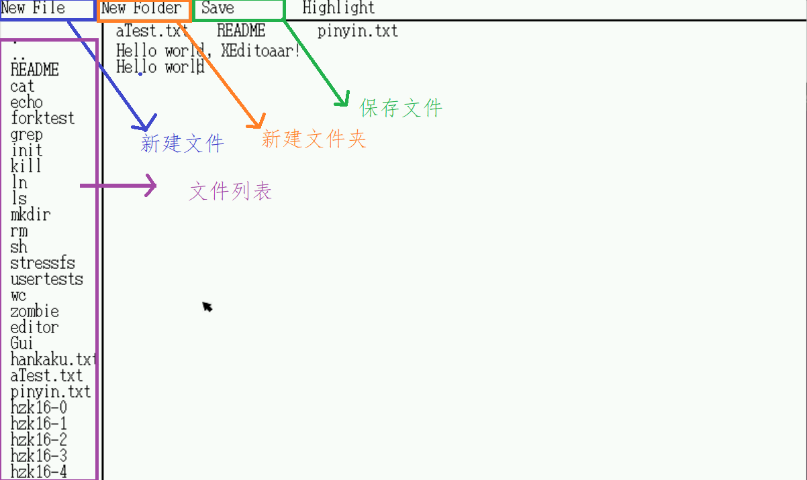

文件列表显示：文件夹和文件，点击文件即可在文本编辑区打开文本，点击文件夹即可进入文件夹。

按钮New File可以新建一个名为New File的文件，New Folder有类似操作。save按钮可以保存当前显示的文本内容。

删除：点击列表文件名，键盘上按下Delete键即可删除。

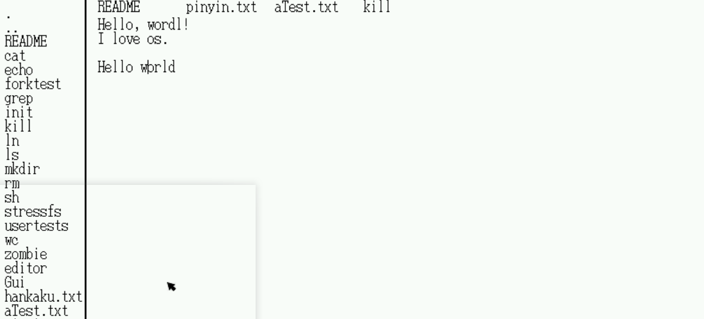

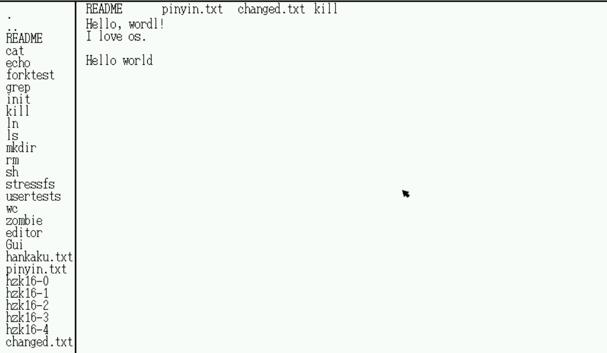

将aText.txt重命名为changed.txt

重命名：右键点击文件名，即可输入，点击该文件名以外的区域即可保存。

###### ⑧标签页的显示、切换、关闭

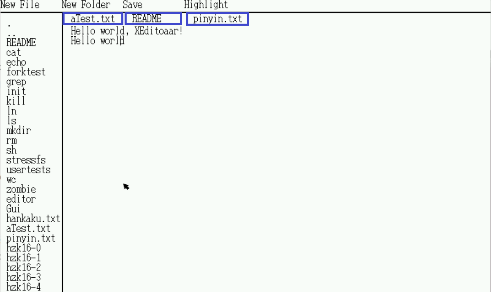

支持标签页打开多个文件窗口，Tab键可以切换，右键点击标签即可关闭。

###### ⑨中文支持和输入法

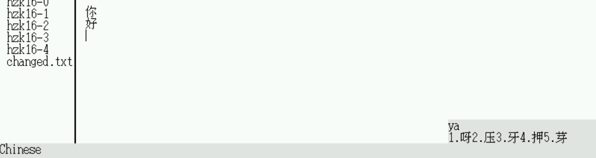

触发：CTRL+P，<>进行左右翻页

在开启输入法之后，键盘打字，输入数字可选择相应的汉字。

###### ⑩快捷键

该部分的功能在前面均已经介绍，在此只进行汇总。

A. CTRL + C, CTRL + V ：复制粘贴

B. TAB：标签页切换

C. CTRL+S：文件保存

D. CTRL+F：检索

E. CTRL + P：输入法

F. Delete:文件删除

###### &#9322;代码高亮

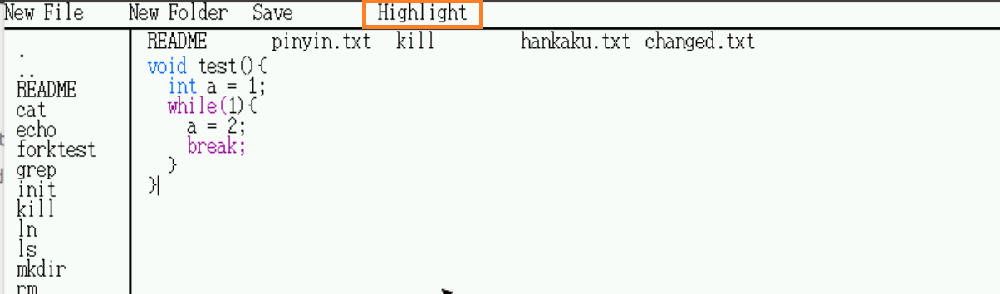

点击工具栏的Highlight按钮即可对代码进行高亮显示。

###### ⑫放大缩小

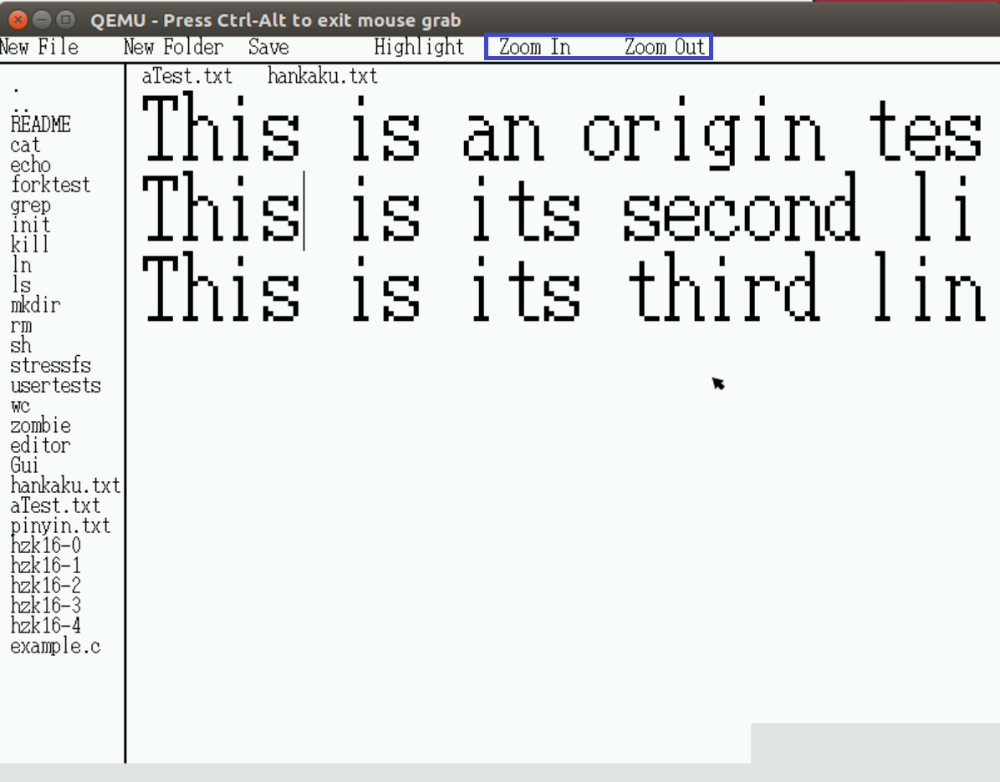

点击工具栏的Zoom In、Zoom Out按钮即可对文本进行放大、缩小显示。最大为32×64， 最小为8×16.

## 三、难点实现介绍

#### 1.中文支持

#### 2.输入法功能

#### 3.文件操作

#### 4.多文本框显示

#### 5.代码高亮与搜索功能

#### 6.追随光标自动翻页

## 四、分工

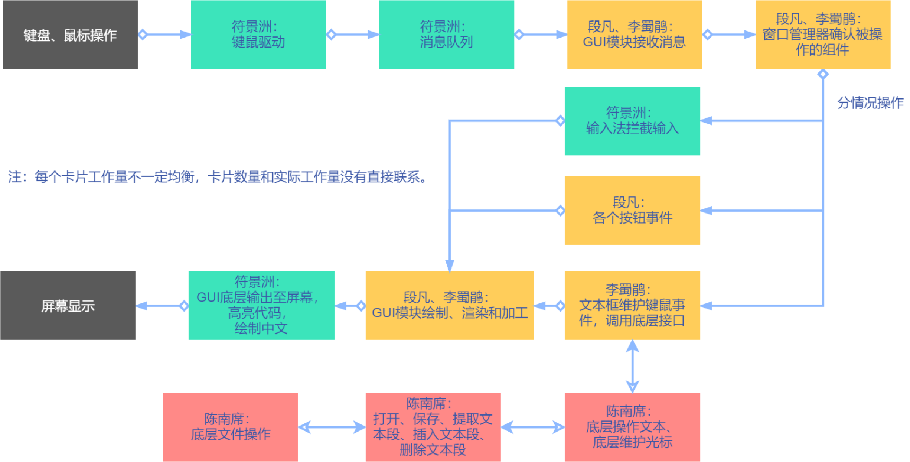